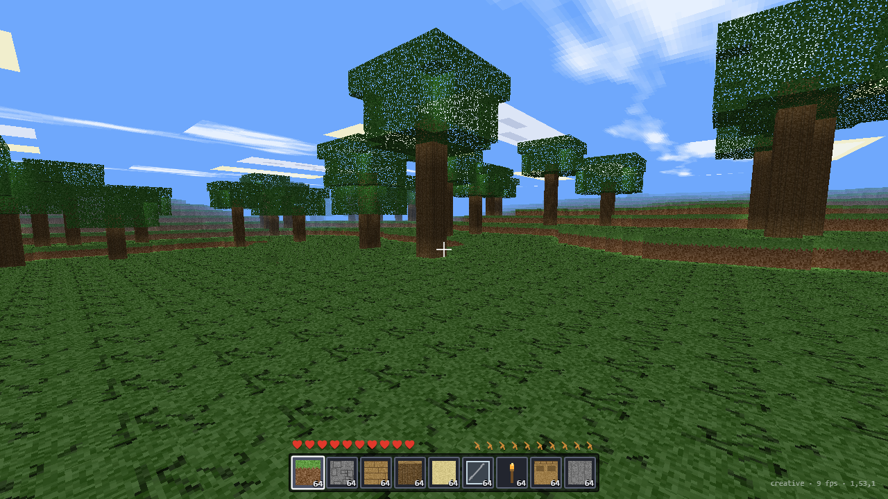

# VoxelCraft

**A Minecraft-style voxel sandbox that runs from one HTML file.**

Raw WebGL2, no dependencies, no build step, no external assets — every texture is painted
procedurally into a canvas at load time. Open `index.html` and you have an infinite world.

**Live:** https://nwfella.github.io/voxelcraft-web/



---

## Features

### World
- **Infinite chunked terrain** — 16 × 16 × 88 chunks streamed around the player, generated
  from layered value noise with a deterministic world seed.
- **Biomes** — plains, forest, desert, snow, mountains and ocean, driven by continent /
  temperature / humidity noise, with matching surface blocks (grass, sand, snow, stone).
- **Caves and ravines** — deterministic tunnel carving whose paths are a pure function of
  their origin, so caves continue seamlessly across chunk borders instead of ending in a
  flat wall. Lava pools below y = 9.
- **Ore veins** — coal, iron, gold and diamond placed as ellipsoid veins on hashed lattice
  cells with depth bands (diamond only below y = 15), plus gravel pockets.
- **Trees** that cross chunk boundaries.
- **Real lighting** — flood-filled skylight and torch block light, so caves are genuinely
  dark, overhangs cast shadows, and a torch lights a room. Per-vertex smoothing and
  ambient occlusion.
- **Day/night cycle** — moving sun and moon, sky colour that runs through dusk, drifting
  clouds, and distance fog that hides chunk loading.

### Survival
- **Mining with real timings** — stone takes 7.5 s by hand and 1.125 s with a wooden
  pickaxe; diamond ore needs an iron pickaxe to drop anything.
- **16 tools** across four tiers (wood / stone / iron / diamond — pickaxe, axe, shovel,
  sword) with durability bars and speed multipliers.
- **Crafting** — 2 × 2 in the inventory, 3 × 3 at a crafting table, with shaped and
  mirrored recipes; tools, torches, planks, sticks, a furnace, a bookshelf.
- **Smelting** — iron ore → ingot, sand → glass, cobblestone → stone, raw porkchop →
  cooked, log → charcoal, with per-fuel burn times.
- **Health, hunger, air and damage** from falls, drowning, lava, starvation and mobs;
  regeneration when fed.
- **Mobs** — pigs wander and drop porkchops; zombies hunt you at night and burn in
  daylight. Knockback, hurt flashes and death drops.
- **Item drops** with pickup, drop merging and a middle-click block picker.

### Presentation and controls
- **Pointer-lock mouse look**, WASD, sprint, jump, creative flight, full key remapping to
  hotbar slots, `F3` debug overlay.
- **Touch controls** — virtual joystick, drag-to-look and jump / mine / place / inventory
  buttons, with an optional left-handed layout.
- **Settings panel** — render distance, FOV, mouse sensitivity, volume, ambient occlusion,
  smooth lighting, clouds; persisted to localStorage.
- **Synthesised audio** — every sound effect is generated with the Web Audio API
  (per-material dig and footstep sounds, mobs, splash, crafting); no audio files.
- **Saved worlds** — block edits, inventory, position, time and furnace contents persist to
  localStorage, with a save/continue flow.

## How to play

| Input | Action |
|---|---|
| `W` `A` `S` `D` | Move |
| Mouse | Look (click to capture the pointer) |
| `Space` | Jump / fly up |
| `Shift` | Descend while flying |
| `Ctrl` | Sprint |
| Left click | Mine (hold) / attack |
| Right click | Place block / eat / open a crafting table or furnace |
| Middle click | Pick block |
| `1`–`9`, wheel | Select hotbar slot |
| `E` | Inventory and crafting |
| `Q` | Drop the held item |
| `F` | Toggle flight (creative) |
| `F3` | Debug overlay |
| `Esc` | Pause |

On touch devices: left thumb on the joystick, drag anywhere else to look.

## Running it

```bash
# it is one file — open it, or serve it
python -m http.server 8000     # then visit http://localhost:8000
```

## Verification

```bash
node scripts/verify_game.js    # 113 assertions against the real game script in a DOM/WebGL stub
node scripts/profile_gen.js    # per-chunk cost breakdown (gen / light / mesh)
node scripts/bench_noise.js    # noise primitive benchmark
```

`verify_game.js` boots the actual `<script>` from `index.html` inside a `vm` sandbox with
stubbed DOM and WebGL contexts, then exercises world generation, lighting propagation,
meshing (with exact face counts for known geometry), raycasting, player physics and
collision, mining and drop rules, crafting recipes, furnace smelting, mob AI and combat,
save/load round-trips and registry integrity.

There is also an in-page benchmark with framebuffer pixel probes, used as the deploy gate:

```
index.html?auto=1&bench=1&mode=creative
```

It writes per-chunk timings, stream-load time and sampled framebuffer pixels into
`document.title`, so a headless run can assert the world genuinely renders.

## Performance notes

Measured in Chrome via the in-page benchmark (software-rendered headless, so CPU-bound):

| Stage | Before | After |
|---|---|---|
| Chunk generation | 52.3 ms | **4.5 ms** |
| Lighting | 10.8 ms | **7.5 ms** |
| Meshing | 34.7 ms | **29.5 ms** |
| 120 sim ticks | 3341 ms | **44 ms** |

Two optimisations did most of the work:

1. **Structured placement instead of noise thresholding.** Ores and caves were originally
   found by evaluating 3-D fBm several times per stone cell — millions of noise samples per
   chunk. They are now *placed*: hashed lattice cells seed ellipsoid veins, and tunnels are
   carved along deterministic random walks, which is both ~9× faster and much closer to how
   Minecraft actually looks.
2. **Hot-path de-allocation.** The mesher allocated a fresh array per face corner
   (~23 k arrays per chunk) and did every neighbour and light lookup through string-keyed
   map lookups on world coordinates. Chunk keys are now integers with a one-entry chunk
   cache, interior faces sample light directly out of the chunk arrays with index
   arithmetic, and the per-corner state lives in a preallocated scratch buffer.

## Tech stack

Canvas 2D (procedural texture atlas) · WebGL2 · Web Audio API · Pointer Events /
Pointer Lock · localStorage · zero dependencies, single file, no build step.

## License

MIT — see [LICENSE](LICENSE).
